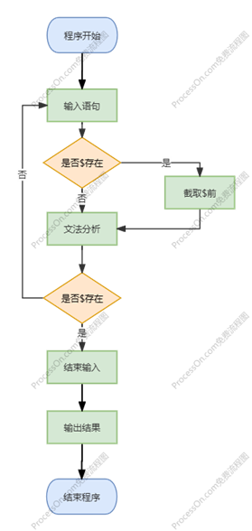
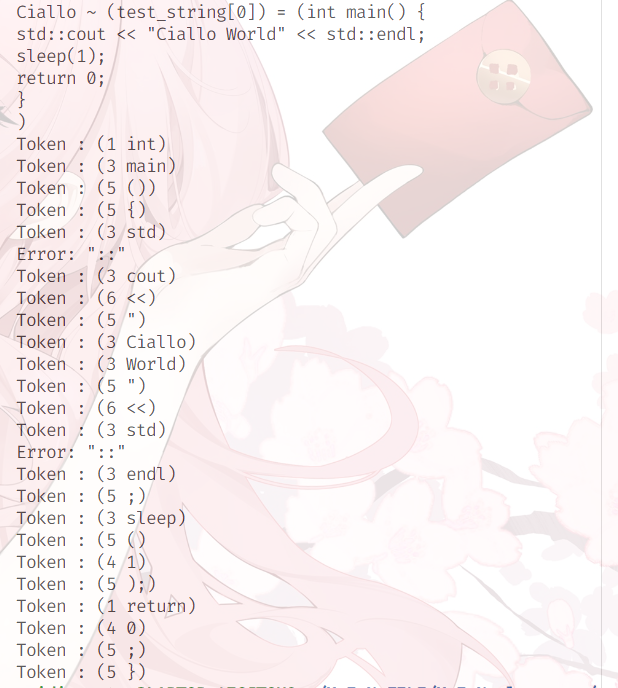
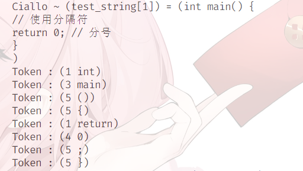
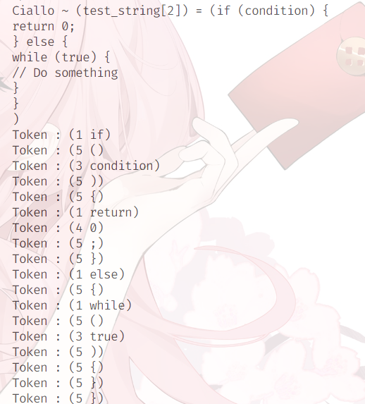
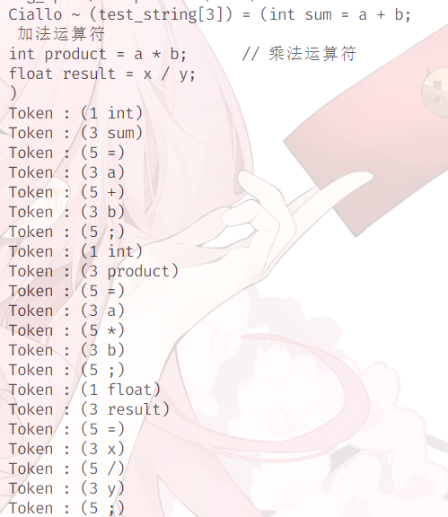
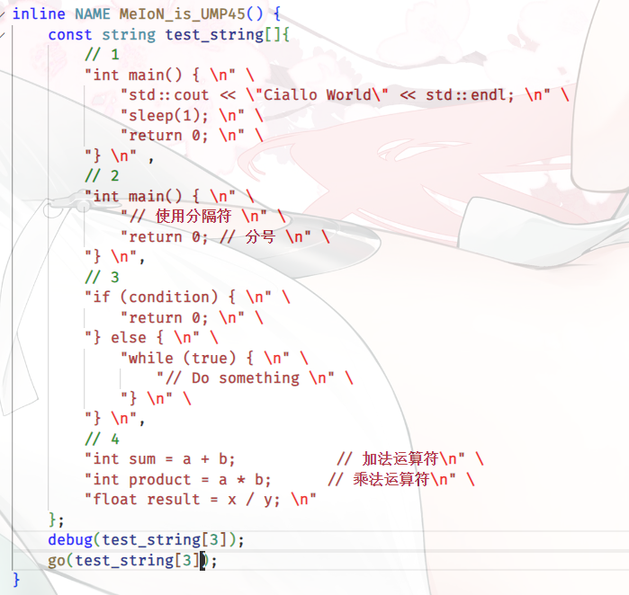

### <center>《编译原理》专题1_词法分析程序设计原理与实现 实验报告</center>
#### <center>22281089 &nbsp; 陈可致</center>
- [《编译原理》专题1\_词法分析程序设计原理与实现 实验报告](#编译原理专题1_词法分析程序设计原理与实现-实验报告)
  - [22281089   陈可致](#22281089--陈可致)
    - [实验目的](#实验目的)
    - [实验内容](#实验内容)
    - [实验环境](#实验环境)
    - [实验过程](#实验过程)
    - [实验结果](#实验结果)
    - [心得体会](#心得体会)
##### 实验目的
        按照预先设定的正则文法集设计并实现其词法分析程序. 
##### 实验内容
        以下为正则文法所描述的C 语言子集单词符号的示例，请补充单词符号： 
    ++，--，  >>,    <<, += , -= ,*=, /=  ，&&（逻辑与），||（逻辑或），！（逻辑非）等等，给
    出补充后描述C 语言子集单词符号的正则文法，设计并实现其词法分析程序.  
        以下文法为左线性正则文法： 
    <标识符>→字母︱  <标识符>字母︱  <标识符>d 
    <无符号整数>→数字︱  <无符号整数>数字 
    <单字符分界符>→+  ︱－  ︱*  ︱；︱,  ︱(︱)  ︱{︱} 
    <双字符分界符>→<大于>=︱<小于>=︱<小于>>︱<感叹号>=︱<等于>=︱<斜竖>*         
    <小于>→<            <等于>→=            <大于>→>            <斜竖>  →/       
    <感叹号>→! 
    
        该语言的保留字  ：void、int、float、double、if、else、for、do、while  等等（也可
    补充）. 
##### 实验环境
- Linux
- vscode
- gcc (Ubuntu 13.2.0-23ubuntu4) 13.2.0
##### 实验过程
- 代码流程 
  
  

- 对类型的划分
    ```cpp
    using token_type = int;
    constexpr token_type error = 0,
                         keyword = 1,
                         comment = 2,
                         variable = 3,
                         unsigned_int = 4,
                         single_operator = 5,
                         double_operator = 6;
    ```
- 关键字
    ```cpp
    const vector<string> keywords {
        "void", "int", "float", "double", "if", "else", "for", "do", 
        "while", "return", "switch", "case", "break", "continue", "default"
    };
    ```
- 单字符符号
    ```cpp
    const string single_operators {"+-*/;(),={}\""};
    ```
- 双字符符号
    ```cpp
    const vector<string> double_operators {
        "++", "--", "+=", "-=", "*=", "/=", ">>", 
        "<<", "&&", "||", "!=", "==", "<=", ">="
    };
    ```
    
- 对token的初步划分, 利用 '\n' 和 ' ' 作初步划分
    ```cpp
    inline vector<string> get_token(string input) {
        static string token;
        std::istringstream _tmp(input);
        vector<string> pretokens, tokens;
        
        while (std::getline(_tmp, token, '\n')) {
            pretokens.emplace_back(token);
        }

        for (const string s : pretokens) {
            _tmp = std::istringstream(s);
            while (std::getline(_tmp, token, ' ')) {
                if (token == "//") break;
                tokens.emplace_back(token);
            }
        }
        
        return tokens;
    }
    ```
- 进一步划分token, 拆分符号与其他内容
    ```cpp
    inline void work(const string &token) {
        int sz = token.size();
        if (not sz) return;
        int i, pr;
        for (i = 0, pr = 0; i < sz; ++i) {
            if (not std::isalnum(token[i])) {
                if (i + 1 < sz and not std::isalnum(token[i + 1])) {
                    out(token.substr(pr, i - pr));
                    out(token.substr(i, 2));
                    pr = i + 2;
                    ++i;
                } else {
                    out(token.substr(pr, i - pr));
                    out(token.substr(i, 1));
                    pr = i + 1;
                }
            }
        }
        out(token.substr(pr));
    }
    ```
- 对token类型的判断
    ```cpp
    token_type get_token_type(const string &token) {
        const int n = token.length();
        // ketwords ? 
        for (const string &s : keywords) {
            if (token == s) return keyword;
        }
        // double operator ? 
        for (const string &s : double_operators) {
            if (token == s) return double_operator;
        }
        // single operator
        for (const char c : single_operators) {
            if (c == token[0]) return single_operator;
        }
        // unsigned int ? 
        if (not not std::isdigit(token[0])) {
            int _ok = 1;
            for (int i = 1; i < n and _ok; ++i) {
                _ok &= not not std::isdigit(token[i]);
            }
            return _ok ? unsigned_int : error;
        }
        // variable ? 
        if (not not std::isalpha(token[0]) or token[0] == '_') {
            int _ok = 1;
            for(int i = 1; i < n and _ok; ++i) {
                _ok &=not not std::isalnum(token[i]) and token[i] != '_';
            }
            return _ok ? variable : error;
        }
        // error
        return error;
    }
    ```
- 判断token类型并输出
    ```cpp
    inline void out(const string &token, token_type type = -1) {
        if (not token.size()) return;
        if (not ~type) type = get_token_type(token);
        if (type == error) {
            return std::cout << "Error: \"" << token << "\"" << std::endl, void();
        }
        std::cout << "Token : (" << type << " " << token << ")" << std::endl;
    }
    ```
##### 实验结果
- 各项功能正常运行, 源码见附件
  - test_0 
  
  
  - test_1 

  
  - test_2 
  
  
  - test_3 
  
  
- 四个测试样例
  
##### 心得体会
有趣, 学到很多, 不仅加深了对编译原理的理解，也提升了我的编程技能. 这一经历让我认识到，编程不仅仅是解决问题，更是逻辑思维与创造力的结合. 我期待在未来的学习中，继续探索编译器的其他方面.